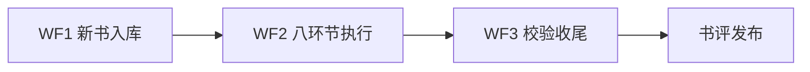

# 一年50本书 · AI 阅读执行系统

把"读一本书"变成结构化产出：8 个环节、金句逐字校验、真实页码、可发布书评。本地工作台（index.html）可视化追踪进度，数据存用户自己的目录。

> 包结构：本技能所有文件平铺在根目录，无子目录。脚本、参考文档、工作台模板都在同级。

## 首次使用：初始化工作目录

1. 问用户要一个工作目录（缺省建议 `<工作区>/reading-data/`）。
2. 复制工作台模板：`index.html` 直接放进工作目录根目录；`state.js` 放进 `工作目录/data/state.js`（同目录下 index.html 以 `data/state.js` 相对路径加载它，这两者的相对位置不能变）。
3. 让用户用浏览器打开 `index.html` 确认工作台可用（或起本地 http 服务）。
4. 引导用户完成**身份画像**（工作台「🎯 身份画像」按钮，或直接写 `data/state.js` 的 `profile`）：身份角色 / 目标 / 兴趣主题 / 读这些书为了什么。环节5、6、8 都靠它做个性化。

## 核心流程

### WF1 新书入库 → 读 @wf1-add-book.md

用户给 epub / PDF / 粘贴文本 → 转全文 md → `split_fulltext.js` 切章 → `add-book.js` 入库。
**用户没有电子书但微信读书里有**：走 OCR 兜底路线（配套技能 `weread-ocr-capture`），详见 wf1 §1B——这条路线**没有逐页页码**，只能标章级区间，必须如实告知用户。
铁律：书名三处逐字一致；只处理用户自己提供的书。

### WF2 八环节执行 → 读 @wf2-eight-stages.md

逐环节生成内容、写入 `data/state.js`、过质量门后标 done。
关键纪律：评价/热评不许编造；金句逐字对照原文；环节5/6/8 必须结合用户身份画像；每 1-2 环节提醒用户导出落盘。

### WF3 校验收尾 → 读 @wf3-gateways.md

`pipeline.js <书名> --data <工作目录>`：金句逐字校验（硬网关）→ 案例锚点校验（软网关）→ 真实页码注入 → 单书数据提取。先 `--dry-run` 再真跑。

### WF4 在线工作台发布（可选）→ 读 @wf4-online-workbench.md

`publish-online.js` 从源码生成发布包（注入 `buildStamp` 内容指纹）→ `test-gate.py` 真实浏览器跑口令门 7 项 → `test-stamp.py` 跑版本戳 2 项 → 上传到静态托管。
口令门只改 `var PASS=` 一处；**发布包的任何手工改动都必须回灌源码**，否则下次重建就丢。
**数据更新后老访客看到的可能还是旧数据**——`buildStamp` 就是为此存在的，务必用 `publish-online.js` 生成发布包（它自动注入），别手工拷 state.js。

### 书评发布

环节8 产出书评稿后，在工作台过五道网关，**发布动作必须经用户确认**。发布渠道由用户决定（公众号后台粘贴或 API 工具）。

## 用户体验约定

- 对话驱动：用户说意图（"帮我拆《思考，快与慢》"），agent 跑命令、生成内容、写数据，用户在工作台看结果、做勾选和批注。
- 内容不满意时：就地改 / 带反馈重生成 / 固化风格偏好，三层机制见 wf2。
- 版权红线：系统不分发书籍内容；金句引用限于合理范围；拆解以转述+解读为主。

## Resources

- `add-book.js` — 书目入库（--state 指定数据文件）
- `epub2fulltext.py` — EPUB → 全文 md
- `pdf2fulltext.py` — PDF → 全文 md（书签驱动切章 + 真实页码标记）
- `split_fulltext.js` — 全文切章
- 没有电子书时：配套技能 `weread-ocr-capture` 抓微信读书网页版正文（截图 + OCR；无逐页页码）
- `pipeline.js` — 校验+页码+提取 一键收尾（--data 指定工作目录）
- `save-export.js` — 工作台导出 JSON 回填 state.js
- `publish-online.js` — 从源码生成在线工作台发布包（--data/--out/--title，带版权红线自检 + 注入 buildStamp 内容指纹）
- `test-gate.py` — 口令门真实浏览器 7 项回归
- `test-stamp.py` — 发布版本戳 2 项回归（旧缓存重播种 / 戳一致不白刷）
- `test-mobile.py` — 移动端双视口 35 项回归（含翻页式分页：无纵向滚动 / 页数 / 翻页 / 末页禁用 / 桌面零分页）
- `gen-ledger.py` — 从 `data/state.js` 生成「1年50本进度台账」Markdown（数字全脚本统计，含待续清单 + 数据质量自检）。在**工作台根目录**下运行，路径全走环境变量：`READING_ROOT`（工作台根，默认当前目录）/ `LEDGER_OUT`（台账输出，默认写在工作台根）/ `VAULT_NOTE_DIR`（笔记沉淀目录，用于「已沉淀」标记，留空则该列全为 —）/ `LEDGER_WORKBENCH`（台账头部的在线工作台链接，留空则不写）/ `TARGET`（年度目标，默认 50）
- `index.html` + `state.js` — 工作台模板（复制即用；PASS 是占位口令，部署前改一处）
- @wf1-add-book.md — 新书入库详解
- @wf2-eight-stages.md — 八环节生成规范与质量门
- @wf3-gateways.md — 校验网关、数据维护与事故恢复
- @wf4-online-workbench.md — 在线工作台发布三步、口令门设计与事故 E 复盘
